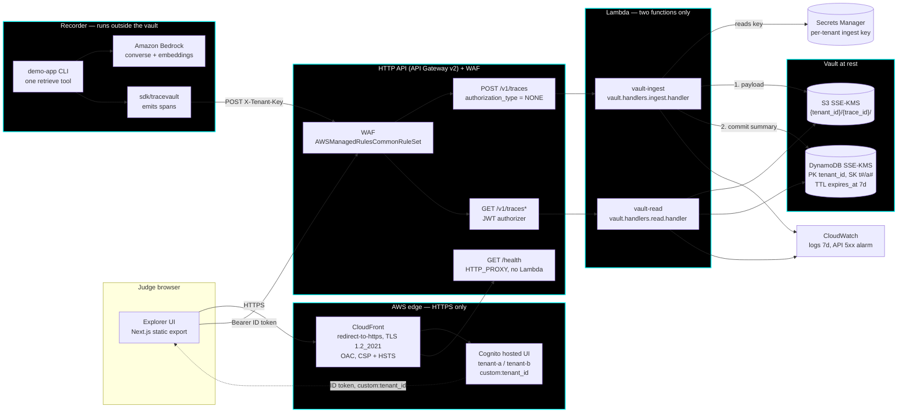

# Architecture

Submission item 4. Handbook §2 Design (minimum output: architecture diagram) and §5 Production Readiness → Architecture, *"Is it understandable and deployable?"*

TraceVault records one AI request as a **flight**: a single `trace_id` with parent-child spans of kind `http`, `rag`, `tool`, and `llm`. The design goal is that a flight can be reconstructed after the fact without the store ever holding a raw prompt or raw PII.

## Data flow and trust boundaries



## The trust boundary that matters: ingest key ≠ user JWT

The two ways into this system are authenticated by **different credentials with different blast radius**, and neither can be substituted for the other.

| | Write path | Read path |
|---|---|---|
| Route | `POST /v1/traces` | `GET /v1/traces*` |
| Credential | `X-Tenant-Key` — opaque per-tenant secret | `Authorization: Bearer <Cognito **ID** token>` |
| Where it lives | Secrets Manager, under the stack CMK | Issued by Cognito to a signed-in human |
| Gateway config | `authorization_type = "NONE"` — no Cognito on this route | JWT authorizer validates the token |
| Who holds it | The recorder (a machine) | A judge or on-call human (a person) |
| What it can do | Append spans for **its own** `tenant_id` only | Read flights for **its own** `custom:tenant_id` only |

Two consequences worth stating explicitly, because both are easy to get wrong:

**The gateway does not enforce tenant isolation.** The JWT authorizer proves only that the token is real and issued by our pool. Comparing the token's `custom:tenant_id` against the stored tenant — and returning **403, not 404** — happens inside `vault-read`. API Gateway cannot do it, so isolation is application logic, tested as such.

**The ID token is required, not the access token.** Cognito puts custom attributes on the ID token only. An *access* token is accepted by the JWT authorizer but arrives at `vault-read` with no `custom:tenant_id`, so the gateway will not catch the mistake. `vault-read` fails closed with `401` rather than defaulting to any tenant.

A third boundary sits inside the write path: the SDK's `prompt_preview` is a **hint, not the authority**. `vault-ingest` re-runs redaction over every free-text field it receives and refuses the batch if anything is unsafe. A compromised or buggy recorder cannot talk its way past the vault's own redaction.

## Write path, in order

The order is the durability guarantee, not an implementation detail.

1. `POST /v1/traces` with `X-Tenant-Key`. Constant-time compare against both per-tenant secrets; unknown or unreadable → `401`.
2. Schema validation against `contracts/span.schema.json`, plus: one `trace_id` per batch, ≤100 spans, unknown span fields rejected, and **span `tenant_id` must equal the key's tenant** — a tenant-a key cannot write spans labelled tenant-b.
3. Redaction over `name`, `error_message`, `prompt_preview`, and every string nested in `attributes` and `events`. Anything unsafe → `400 redaction_failed`, **and the store is never called**.
4. Payload to S3 under `{tenant_id}/{trace_id}/`.
5. Summary item to DynamoDB. **This is the commit point.** The ingest role has no `s3:DeleteObject`, so a failed Dynamo write leaves an unreachable orphan object rather than a half-visible flight.

The failure mode is deliberately data loss, never a leak.

## Deployment path

```
Terraform (infra/)  →  human-approved apply  →  deploy.yml on main only  →  CloudFront URL
```

- **IaC.** `infra/` is Terraform ≥ 1.9 against `us-east-1`. State is remote (S3 + DynamoDB lock); `infra/backend.tf.example` is the template. Variables come from `infra/envs/{dev,prod}.tfvars`; the `.example` files are the only committed variable documentation.
- **CI identity.** GitHub Actions authenticates with **OIDC** — `infra/oidc.tf` creates a role trusted only by this repository. There is no long-lived AWS key in the repo, and `gitleaks` fails the PR if one appears.
- **Deploy trigger.** `.github/workflows/deploy.yml` runs on `main` only. No deploy from a feature branch.
- **Rollback.** Re-run the last green `deploy.yml`. There is no separate rollback script, by design — one mechanism, already exercised.
- **Runbook.** `make help` is the runbook: health check, tenant users, rollback, and where the logs live.

## What is deployed today

**Nothing.** No `terraform apply` has run and there is no public URL. The Terraform above is written, merged, and passes `validate`, but it describes intended infrastructure, not running infrastructure. See **Demo integrity (P-15)** in [`README.md`](../README.md) for the current built-versus-deployed split, and [`SECURITY.md`](../SECURITY.md) for which threats have tests today.
